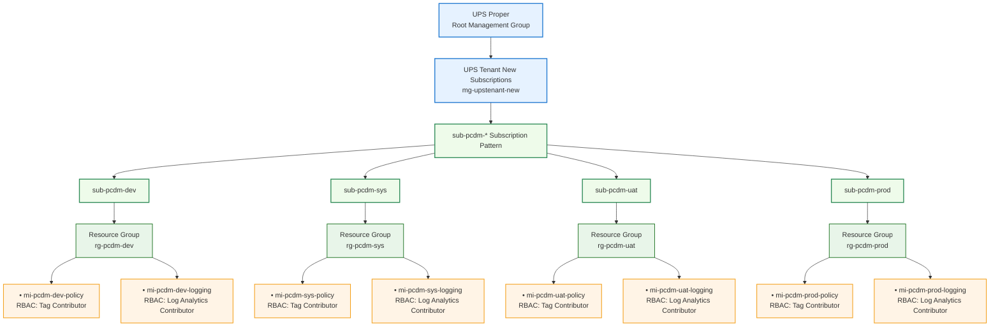

# Azure-Management-Group
Here is the **updated Mermaid org-style diagram** with the **Resource Group naming simplified** to exactly what you requested:

**Resource Groups**

* `rg-pcdm-dev`
* `rg-pcdm-sys`
* `rg-pcdm-uat`
* `rg-pcdm-prod`

Managed identities remain **under the resource group**.

---



---

# Final Naming Standard

### Subscriptions

```
sub-pcdm-dev
sub-pcdm-sys
sub-pcdm-uat
sub-pcdm-prod
```

### Resource Groups

```
rg-pcdm-dev
rg-pcdm-sys
rg-pcdm-uat
rg-pcdm-prod
```

### Managed Identities

```
mi-pcdm-dev-policy
mi-pcdm-dev-logging

mi-pcdm-sys-policy
mi-pcdm-sys-logging

mi-pcdm-uat-policy
mi-pcdm-uat-logging

mi-pcdm-prod-policy
mi-pcdm-prod-logging
```

---

💡 **Architecture Intent**

This structure gives you a **clean Azure governance layout**:

```
Management Group
   → Subscription (environment isolation)
      → Resource Group (identity container)
         → Managed Identity (RBAC automation)
```

Used for:

* **Azure Policy remediation**
* **Tag governance**
* **Diagnostic logging**

---

If you'd like, I can also show you a **much cleaner enterprise diagram** that compresses this entire layout into a **single repeating pattern block** like this (very common in Azure architecture docs):

```
sub-pcdm-[env]
   └ rg-pcdm-[env]
        ├ mi-pcdm-[env]-policy
        └ mi-pcdm-[env]-logging
```

It makes the diagram **50–60% smaller and easier for architecture boards to read**.
