# Azure-Management-Group

Here is the **updated Mermaid org-style diagram** with your requested changes:

Changes applied:

* Managed Identity naming: **`mi-pcdm-[env]-[policy/logging]`**
* Added **Contributor role for Resource Group creation**
* Under **Managed Identities**, roles appear as **bullet-style child nodes**
* Environments: **dev, sys, uat, prod**
* Subscription wildcard: **`sub-pcdm-*`**

```mermaid
graph TD

    A[UPS Proper<br>Root Management Group]

    A --> B[UPS Tenant New Subscriptions<br>mg-upstenant-new]

    B --> C[sub-pcdm-* Subscription Pattern]

    C --> D[sub-pcdm-dev]
    C --> E[sub-pcdm-sys]
    C --> F[sub-pcdm-uat]
    C --> G[sub-pcdm-prod]

%% DEV
    D --> D1[Managed Identity<br>mi-pcdm-dev-policy]
    D1 --> D2["• Tag Contributor"]
    D1 --> D3["• Contributor (Resource Group Creation)"]
    D1 --> D4["• Custom Policy Remediation"]

    D --> D5[Managed Identity<br>mi-pcdm-dev-logging]
    D5 --> D6["• Log Analytics Contributor"]
    D5 --> D7["• Send Logs to Log Analytics Workspace"]

%% SYS
    E --> E1[Managed Identity<br>mi-pcdm-sys-policy]
    E1 --> E2["• Tag Contributor"]
    E1 --> E3["• Contributor (Resource Group Creation)"]
    E1 --> E4["• Custom Policy Remediation"]

    E --> E5[Managed Identity<br>mi-pcdm-sys-logging]
    E5 --> E6["• Log Analytics Contributor"]
    E5 --> E7["• Send Logs to Log Analytics Workspace"]

%% UAT
    F --> F1[Managed Identity<br>mi-pcdm-uat-policy]
    F1 --> F2["• Tag Contributor"]
    F1 --> F3["• Contributor (Resource Group Creation)"]
    F1 --> F4["• Custom Policy Remediation"]

    F --> F5[Managed Identity<br>mi-pcdm-uat-logging]
    F5 --> F6["• Log Analytics Contributor"]
    F5 --> F7["• Send Logs to Log Analytics Workspace"]

%% PROD
    G --> G1[Managed Identity<br>mi-pcdm-prod-policy]
    G1 --> G2["• Tag Contributor"]
    G1 --> G3["• Contributor (Resource Group Creation)"]
    G1 --> G4["• Custom Policy Remediation"]

    G --> G5[Managed Identity<br>mi-pcdm-prod-logging]
    G5 --> G6["• Log Analytics Contributor"]
    G5 --> G7["• Send Logs to Log Analytics Workspace"]

%% Styling
    classDef mg fill:#e6f2ff,stroke:#1f78d1,stroke-width:2px;
    classDef sub fill:#eefbea,stroke:#2e8b57,stroke-width:2px;
    classDef mi fill:#fff4e6,stroke:#f39c12,stroke-width:1.5px;
    classDef role fill:#f4e6ff,stroke:#8e44ad,stroke-width:1.5px;

    class A,B mg;
    class C,D,E,F,G sub;
    class D1,D5,E1,E5,F1,F5,G1,G5 mi;
    class D2,D3,D4,D6,D7,E2,E3,E4,E6,E7,F2,F3,F4,F6,F7,G2,G3,G4,G6,G7 role;
```



### Naming Pattern

**Subscriptions**

```
sub-pcdm-dev
sub-pcdm-sys
sub-pcdm-uat
sub-pcdm-prod
```

**Managed Identities**

```
mi-pcdm-dev-policy
mi-pcdm-dev-logging

mi-pcdm-sys-policy
mi-pcdm-sys-logging

mi-pcdm-uat-policy
mi-pcdm-uat-logging

mi-pcdm-prod-policy
mi-pcdm-prod-logging
```

### RBAC Strategy

| Managed Identity        | Purpose                          | Roles                        |
| ----------------------- | -------------------------------- | ---------------------------- |
| `mi-pcdm-[env]-policy`  | Azure Policy remediation         | Tag Contributor, Contributor |
| `mi-pcdm-[env]-logging` | Diagnostic settings + monitoring | Log Analytics Contributor    |

---

If you'd like, I can also produce a **much cleaner enterprise Azure Landing Zone diagram** that visually shows:

* **Management Group → Policy Assignment**
* **DeployIfNotExists remediation**
* **Managed Identity permissions**
* **Central Log Analytics Workspace**
* **Subscription factory pattern (`sub-pcdm-*`)**

which is **exactly how Azure governance diagrams are typically presented in architecture documents.**
