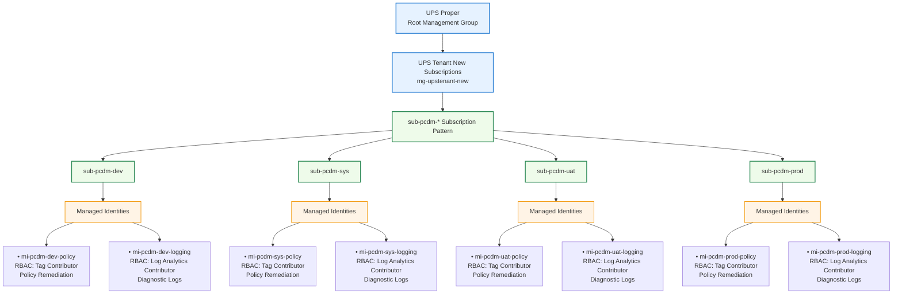

# Azure-Management-Group
Got it — we will **remove the Contributor role** and keep **one Managed Identity per RBAC role**, limited to:

* **Tag Contributor** → Policy remediation
* **Log Analytics Contributor** → Logging / diagnostics

This keeps the model **least-privilege and cleaner for governance**.



### Naming Convention

**Subscriptions**

```
sub-pcdm-dev
sub-pcdm-sys
sub-pcdm-uat
sub-pcdm-prod
```

**Managed Identities**

```
mi-pcdm-[env]-policy
mi-pcdm-[env]-logging
```

Examples

```
mi-pcdm-dev-policy
mi-pcdm-dev-logging
mi-pcdm-prod-policy
mi-pcdm-prod-logging
```

### RBAC Mapping

| Managed Identity        | RBAC Role                 | Purpose                          |
| ----------------------- | ------------------------- | -------------------------------- |
| `mi-pcdm-[env]-policy`  | Tag Contributor           | Azure Policy remediation         |
| `mi-pcdm-[env]-logging` | Log Analytics Contributor | Diagnostic logging configuration |

---

If you'd like, I can also produce a **much cleaner Azure CAF governance diagram** that visually shows:

**Management Group → Policy Assignment → DeployIfNotExists → Managed Identity → Remediation → Log Analytics**

which is the **standard diagram used in Microsoft landing zone documentation.**
