```mermaid
graph TD

    A[UPS Proper<br>Root Management Group]

    A --> B[UPS Tenant New Subscriptions<br>mg-upstenant-new]

    B --> C[sub-pcdm-* Subscription Pattern]

    C --> D[sub-pcdm-dev]
    C --> E[sub-pcdm-sys]
    C --> F[sub-pcdm-uat]
    C --> G[sub-pcdm-prod]

%% DEV
    D --> D1[Managed Identity<br>pcdm-dev-policy-mi]
    D1 --> D2[Azure RBAC Role<br>Tag Contributor]
    D1 --> D3[Custom Policy Remediation<br>Tag Enforcement]

    D --> D4[Managed Identity<br>pcdm-dev-logging-mi]
    D4 --> D5[Azure RBAC Role<br>Log Analytics Contributor]
    D4 --> D6[Send Logs to Log Analytics Workspace]

%% SYS
    E --> E1[Managed Identity<br>pcdm-sys-policy-mi]
    E1 --> E2[Azure RBAC Role<br>Tag Contributor]
    E1 --> E3[Custom Policy Remediation<br>Tag Enforcement]

    E --> E4[Managed Identity<br>pcdm-sys-logging-mi]
    E4 --> E5[Azure RBAC Role<br>Log Analytics Contributor]
    E4 --> E6[Send Logs to Log Analytics Workspace]

%% UAT
    F --> F1[Managed Identity<br>pcdm-uat-policy-mi]
    F1 --> F2[Azure RBAC Role<br>Tag Contributor]
    F1 --> F3[Custom Policy Remediation<br>Tag Enforcement]

    F --> F4[Managed Identity<br>pcdm-uat-logging-mi]
    F4 --> F5[Azure RBAC Role<br>Log Analytics Contributor]
    F4 --> F6[Send Logs to Log Analytics Workspace]

%% PROD
    G --> G1[Managed Identity<br>pcdm-prod-policy-mi]
    G1 --> G2[Azure RBAC Role<br>Tag Contributor]
    G1 --> G3[Custom Policy Remediation<br>Tag Enforcement]

    G --> G4[Managed Identity<br>pcdm-prod-logging-mi]
    G4 --> G5[Azure RBAC Role<br>Log Analytics Contributor]
    G4 --> G6[Send Logs to Log Analytics Workspace]

%% Styling
    classDef mg fill:#e6f2ff,stroke:#1f78d1,stroke-width:2px;
    classDef sub fill:#eefbea,stroke:#2e8b57,stroke-width:2px;
    classDef mi fill:#fff4e6,stroke:#f39c12,stroke-width:1.5px;
    classDef role fill:#f4e6ff,stroke:#8e44ad,stroke-width:1.5px;

    class A,B mg;
    class C,D,E,F,G sub;
    class D1,D4,E1,E4,F1,F4,G1,G4 mi;
    class D2,D5,E2,E5,F2,F5,G2,G5 role;
```

# Azure-Management-Group

Below is an **extended Mermaid org-style diagram** based on your Azure Management Group structure.

Changes made:

* **Removed `test` environment**
* Added **Managed Identity for Policy Remediation**

  * Role: **Tag Contributor**
* Added **Managed Identity for Logging**

  * Role: **Log Analytics Contributor**
* RBAC identities applied **per environment subscription**

---

---

### Environment Naming Convention

| Environment     | Subscription Name |
| --------------- | ----------------- |
| Development     | `sub-pcdm-dev`    |
| System Test     | `sub-pcdm-sys`    |
| User Acceptance | `sub-pcdm-uat`    |
| Production      | `sub-pcdm-prod`   |

---

### Managed Identity Strategy

| Identity            | Purpose                                  | RBAC Role                     |
| ------------------- | ---------------------------------------- | ----------------------------- |
| `pcdm-*-policy-mi`  | Used by Azure Policy remediation tasks   | **Tag Contributor**           |
| `pcdm-*-logging-mi` | Used to send logs / configure monitoring | **Log Analytics Contributor** |

---

If you want, I can also create a **more enterprise Azure landing zone diagram** showing:

* **Management Group → Policy → Subscription → Resource Groups**
* **Policy Assignment**
* **DeployIfNotExists remediation flow**
* **Log Analytics workspace centralization**

which is typically how **Azure CAF governance diagrams** are presented.
