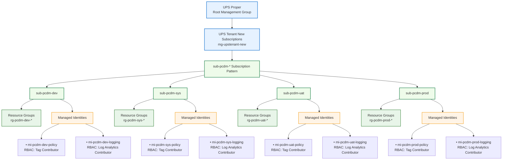

# Azure-Management-Group
You want the diagram to also show **Resource Groups under each subscription**, using the **same naming pattern style** and keeping it **compact**.

Pattern:

* **Subscription:** `sub-pcdm-[env]`
* **Resource Group:** `rg-pcdm-[env]-*`
* **Managed Identity:** `mi-pcdm-[env]-policy` / `mi-pcdm-[env]-logging`

Below is the **updated Mermaid org-style diagram**.



## Naming Standard

### Subscriptions

```
sub-pcdm-dev
sub-pcdm-sys
sub-pcdm-uat
sub-pcdm-prod
```

### Resource Groups

```
rg-pcdm-dev-network
rg-pcdm-dev-app
rg-pcdm-dev-data
rg-pcdm-dev-monitor
```

```
rg-pcdm-prod-network
rg-pcdm-prod-app
rg-pcdm-prod-data
rg-pcdm-prod-monitor
```

### Managed Identities

```
mi-pcdm-dev-policy
mi-pcdm-dev-logging
```

```
mi-pcdm-prod-policy
mi-pcdm-prod-logging
```

## Governance Intent

| Component                               | Purpose                           |
| --------------------------------------- | --------------------------------- |
| **Management Group**                    | Governance + policy inheritance   |
| **Subscription (`sub-pcdm-*`)**         | Environment isolation             |
| **Resource Groups (`rg-pcdm-[env]-*`)** | Workload segmentation             |
| **Managed Identity (`mi-pcdm-*`)**      | Policy remediation + logging RBAC |

---

If you'd like, I can also produce a **very polished Azure Landing Zone architecture diagram** that shows:

```
Management Group
   ├── Policy Initiative
   ├── Subscription Factory
   └── sub-pcdm-[env]
         ├── Resource Groups
         ├── Managed Identity
         ├── Policy Remediation
         └── Log Analytics
```

This version is **much closer to Microsoft's CAF architecture visuals** used in enterprise documentation.
